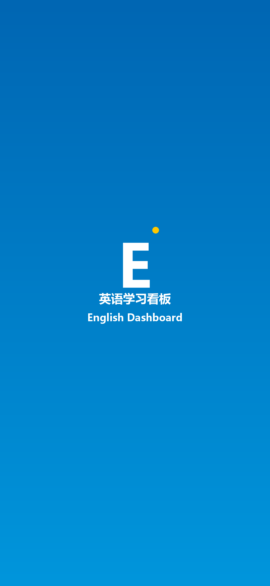

# 📱 iPhone 安装指南 · 把英语看板变成桌面 APP

这份指南手把手带你在 iPhone 上装好"英语看板 APP"。装完后：
- 🏠 桌面多一个蓝色 **E 英语** 图标
- 📱 点开全屏打开，**没有 Safari 地址栏和底部导航**，就是一个纯 APP
- 🎨 打开时有启动图（蓝色渐变 + E logo），不会白屏闪
- 🔄 更新内容后，下拉刷新就能拿到新版
- 💾 本地进度（单词记住/没记住、今日练习次数）保留

---

## ⚡ 走哪条路？

iPhone 装 PWA 有两种场景，看你要哪种：

### 场景 A · 只在家/公司 WiFi 下用（现在就能装，0 成本）

你的电脑正在跑 `http://192.168.1.7:8080`，iPhone 连同 WiFi 直接访问。

**缺点**：
- ❌ 出了 WiFi 就打不开（电脑关机、不在家、蜂窝网络都不行）
- ❌ 离线不能用（iOS 要求 HTTPS 才启用 Service Worker 缓存）

**什么时候走这条**：先试试水，看体验满不满意。

### 场景 B · 随时随地能用（推荐，10 分钟部署一次永久能用）

把看板免费传到 GitHub Pages，拿到 `https://xxx.github.io/english-dashboard/` 地址。iOS 上只有 HTTPS 能开启完整 PWA 功能（离线、缓存、持久化）。

**好处**：
- ✅ 地铁上、客户现场、出差酒店，全部能用
- ✅ 离线也能刷模板、背单词、看语法
- ✅ 电脑关机不影响
- ✅ 能把网址发给 Anna 等学员，大家都能用

**什么时候走这条**：认真要用 —— 直接走这条，别浪费时间。

---

## 🏁 场景 A · 局域网即刻安装（2 分钟）

### 第 1 步：电脑上确认服务在跑

终端里跑：
```bash
cd C:\Users\admin\Desktop\AI--
python -m http.server 8080 --directory english-dashboard --bind 0.0.0.0
```

> 看到 `Serving HTTP on 0.0.0.0 port 8080` 就是跑起来了。

### 第 2 步：iPhone 和电脑连**同一个 WiFi**

iPhone 设置 → WiFi → 看 WiFi 名，和电脑一致。

### 第 3 步：iPhone 打开 Safari（一定要 Safari！）

**重要**：iOS 上只有 **Safari** 能把网站"添加到主屏幕"并正常当 APP 打开。Chrome、UC、微信内置浏览器都不行。

Safari 地址栏输入：
```
http://192.168.1.7:8080
```

> 或用相机扫桌面电脑上的 `phone-qr.png` 二维码（同一个地址）。

页面加载后你会看到英语看板。

### 第 4 步：添加到主屏幕

1. 点击底部中间的 **分享按钮**（方框里一个向上箭头 ⎋）
2. 弹出菜单向下滚，找 **"添加到主屏幕"** （英文：Add to Home Screen）
3. 顶部的 APP 名字自动显示 "英语看板" —— 不用改
4. 右上角点 **"添加"**

现在回到桌面 —— **多了一个蓝色 E 英语图标**。

### 第 5 步：点图标打开

第一次点会看到启动图（蓝色渐变背景 + E + "英语学习看板 · English Dashboard"），然后进入看板。

**顶部 Safari 地址栏消失、底部导航栏消失，完全全屏**——这就是 PWA APP 模式。

---

## 🚀 场景 B · GitHub Pages 永久部署（10 分钟，一劳永逸）

### 第 1 步：注册 GitHub 账号

[github.com](https://github.com) 用邮箱注册。已有账号就跳过。

### 第 2 步：在电脑上建仓库并上传

打开终端，在 `english-dashboard` 目录下：

```bash
cd C:\Users\admin\Desktop\AI--\english-dashboard

# 初始化 git 仓库
git init
git add .
git commit -m "init english dashboard pwa"

# 到 github.com 新建一个名为 english-dashboard 的仓库（公开或私有都行）
# 复制它给你的那条 git remote add 命令，粘到下面

git branch -M main
git remote add origin https://github.com/你的用户名/english-dashboard.git
git push -u origin main
```

### 第 3 步：开启 GitHub Pages

1. 仓库页面 → **Settings**
2. 左边侧栏 → **Pages**
3. Source：`Deploy from a branch`
4. Branch：`main` / `(root)`
5. 点 **Save**

等 1-2 分钟（页面顶部会显示 "Your site is live at ..."），你拿到一个这样的地址：
```
https://你的用户名.github.io/english-dashboard/
```

### 第 4 步：iPhone 上打开并安装

1. Safari 打开上面这个 HTTPS 地址（**一定是 https://**）
2. 底部 **分享** → **添加到主屏幕** → 改名"英语看板" → **添加**
3. 回桌面，点新图标打开 → 全屏 + 启动图

**这一次**，Service Worker 会自动注册，所有内容缓存到手机上。**之后离线、断网、飞行模式，打开看板都能正常用**（除了录音、TTS 这些依赖系统服务的功能）。

---

## 🎨 看板在 iPhone 上长什么样

**桌面图标**（180×180，蓝色圆角方块，白色 E + 黄色装饰点 + "英语"）：


**启动画面**（打开 APP 瞬间的那张图，蓝色渐变 + E + 标题）：


支持的 iPhone 型号（每款都有专属分辨率的启动图）：
- iPhone 15 / 15 Pro / 15 Plus / 15 Pro Max
- iPhone 14 / 14 Plus / 14 Pro / 14 Pro Max
- iPhone 13 系列、12 系列
- iPhone 11 / XR / X / XS / XS Max / 11 Pro / 11 Pro Max
- iPhone 8 / 8 Plus / 7 / 7 Plus / 6s / 6s Plus
- iPhone SE（第 1/2/3 代）

你的 iPhone 不管什么型号，iOS 会自动选最匹配那张。

---

## ⚠️ iPhone 上的注意事项

### ✅ 手机上好用的功能

| 功能 | 说明 |
|------|------|
| 📚 方法区 | 看脱壳法、演讲结构、金字塔 |
| 📖 场景模板 | 读中英对照对话、看语法卡、听朗读 |
| 🔊 朗读（TTS） | **iOS 的语音质量非常好**，比电脑还自然 |
| 📇 术语卡片 | 翻卡、记住/没记住、进度保存 |
| 📋 生成 Claude 指令 | 一键复制，粘到手机版 Claude APP |
| 📊 今日进度 | 本地存储，跨设备不同步 |

### ⚠️ 手机上受限的功能

| 功能 | 状态 | 解决方案 |
|------|------|---------|
| 🎙️ 录音检测 | iOS Safari 的 Web Speech API **识别**支持很差 | 用电脑 Chrome 录音，或用手机版 Claude APP 直接说 |
| 💾 离线缓存 | http:// 模式不支持 | 走场景 B，用 HTTPS 部署 |
| 🔔 推送通知 | iOS 16.4+ 的 PWA 才支持，需要额外开发 | 目前不涉及 |

### 💡 使用小技巧

- **下拉刷新**：在 APP 里从顶部往下拉能刷新页面（拉取最新数据）
- **外链会跳 Safari**：看板内点击外部链接会跳到 Safari 打开，这是 iOS PWA 的规则
- **后台不会被杀**：切到别的 APP 再切回来，状态保留
- **保存进度**：iOS 的"存储空间"管理不会删 PWA 的 localStorage，除非你手动清 Safari

---

## 🔧 常见问题

**Q1: 点"添加到主屏幕"没反应？**
A: 先确认用的是 **Safari**，不是微信 / QQ / 抖音内置浏览器。那些浏览器可以看网页，但不能装 PWA。

**Q2: iPhone 上图标显示的是一个缩略图截图，不是我的 E logo？**
A: 说明 `apple-touch-icon` 没加载成功。检查：
- URL 里有没有 `/icons/apple-touch-icon.png`（电脑浏览器访问一下这个路径看是否 200）
- 清一下 Safari 缓存（设置 → Safari → 清除历史记录和网站数据），重新访问 → 重新添加到主屏

**Q3: 点图标后还是有 Safari 地址栏？**
A: 只可能是 `apple-mobile-web-app-capable` 没读到。确认 iPhone 上看的是对的 URL，并且重新添加一次（删旧图标，从 Safari 重新加）。

**Q4: 启动图白屏 / 启动图拉伸？**
A: iOS 选启动图按 `device-width` + `device-height` + `pixel-ratio` 精准匹配。如果都不匹配就白屏。检查 iPhone 的型号分辨率是否在我们 `index.html` 的 `<link rel="apple-touch-startup-image">` 列表里。常见新款都覆盖了。

**Q5: 怎么卸载？**
A: 长按桌面图标 → 删除 APP → 移除。和普通 APP 操作完全一样。

**Q6: 数据会被 iOS 自动清掉吗？**
A: PWA 的 localStorage 有轻微风险被 iOS 在存储紧张时清理（官方规则：7 天不用可能清）。建议：**每周至少打开一次**，或考虑后续接云同步（我可以帮你加）。

**Q7: 能让学员（比如 Anna）也装吗？**
A: 走场景 B 拿到 HTTPS 地址后，把 URL 发给她就行。她 iPhone 上 Safari 打开 → 添加到主屏 → 用。完全一样的安装流程。

---

## 🎯 你现在该做的事

**如果是马上要试一下**：走场景 A
- 手机连 WiFi → Safari 扫 `phone-qr.png` → 分享 → 添加到主屏 → 点图标打开
- **大概 2 分钟**

**如果是认真要用起来**：走场景 B
- 注册 GitHub → 上传仓库 → 开 Pages → iPhone Safari 打开 HTTPS → 添加到主屏
- **10 分钟搞定，以后永久能用**

我建议**两条路都走**：
1. 先走 A 在手机上试用 5 分钟，确认看板在手机上用着舒服
2. 觉得 OK 再走 B 部署到 GitHub Pages，把图标替换成永久版本

---

> 有问题随时问我。部署 GitHub Pages 那步你跑命令时如果卡了，把错误贴过来我帮你看。
